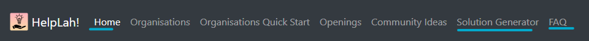
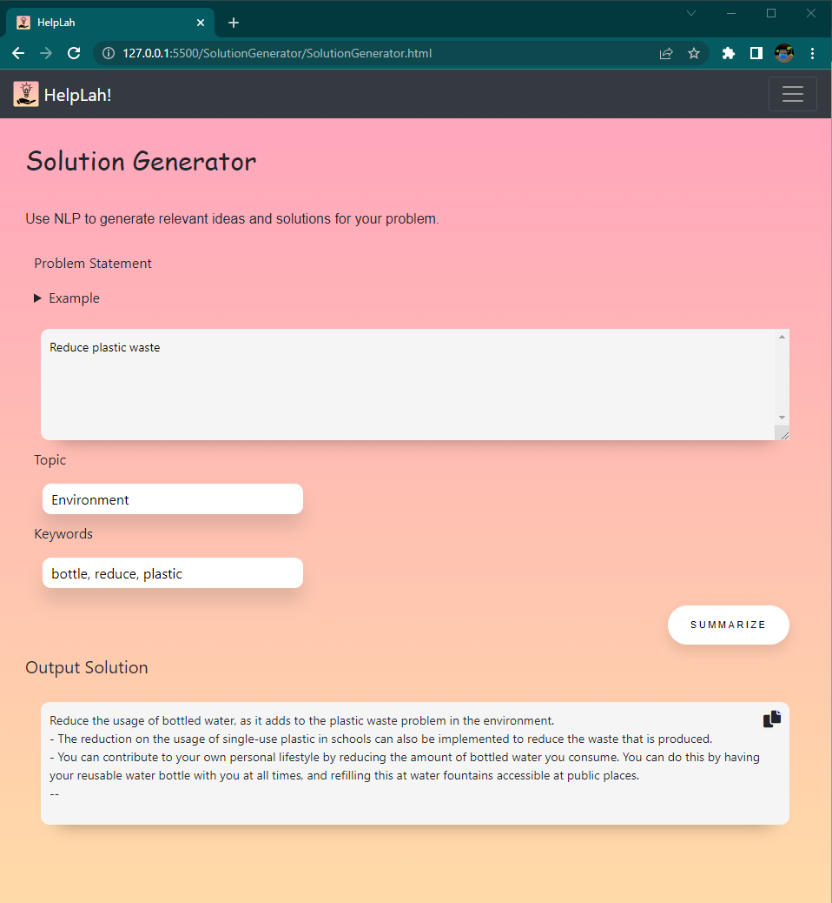
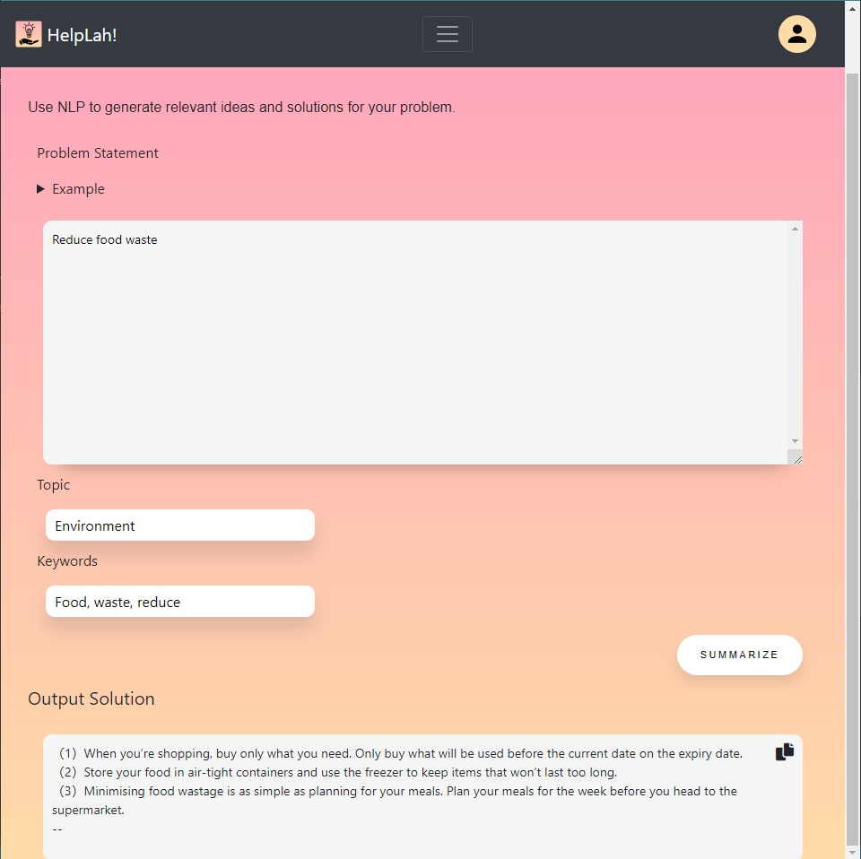

# HelpLah!
Want an opportunity to give back to the community? Come join our mission and HelpLah!

## How to use this website
> This website is still a work-in-progress. There are features that have not been implemented. Due to a lack of time, we decided to prioritise the more interesting features that encompassed NLP.
> 
> Right now, the features we have are:
> - Solution Generator
> - FAQ 

1.  Head over to the [website](https://lifehack2022yay.github.io/HelpLah/)
2.  From the home page, you will see a navigation bar at the top with shortcuts to different pages. The links that work are "Home", "Solution Generator" and "FAQ".

3. Have fun!

 

## Other Website features
* [Figma High Fidelity Prototype](https://www.figma.com/proto/bbOyPBJmiZIZmXS501D8ch/HelpLah!?node-id=2%3A7&scaling=min-zoom&page-id=0%3A1&starting-point-node-id=2%3A7)

 

### Sample outputs from the solution generator
:exclamation: Disclaimer: The solution generator may sometimes give strange results, and sometimes unique and unorthrodox solutions, depends on the NLP model lol

* Reduce plastic waste

* Reduce food waste

## Tutorials/Resources/Credits
* [Fancy Button](https://codepen.io/seme332/pen/reJOwo)
* images gotten from unsplash and canva
